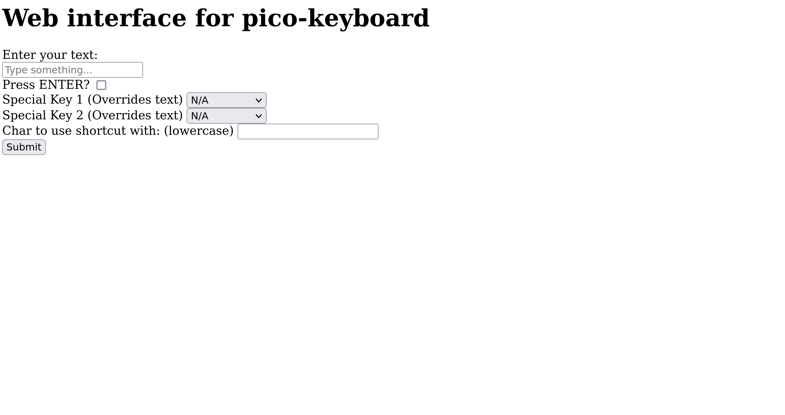

## picow-keyboard
Turn your Raspberry Pi Pico W in a portable keyboard! Simply plug it into any system, connect to the AP it starts, and use this HTML interface:

This was designed to be quick and easy to use, though there is a teensy bit of a setup involved.

## Braindead Installation Process (If you trust me)
1. Hold down BOOTSEL button on the Pico before plugging it in. Download the .uf2 file of [CircuitPython 9.x](https://github.com/adafruit/circuitpython/releases/tag/9.1.1) and drop it in the root of the pi.
2. Delete everything in the root directory, and replace with the contents of `picokeyboard.tar.gz`

## Proper Installation Process
1. Hold down BOOTSEL button on the Pico before plugging it in. Download the .uf2 file of [CircuitPython 9.x](https://github.com/adafruit/circuitpython/releases/tag/9.1.1) and drop it in the root of the pi.
2. Download the [adafruit_hid library](https://github.com/adafruit/Adafruit_CircuitPython_HID/releases/tag/6.1.1) and download a 9.x compatible version `circuitpython-hid-9.x-mpy-6.1.1.zip`). Extract the `lib` folder into the pi's lib folder.
2. Download the [adafruit_httpserver library](https://github.com/adafruit/Adafruit_CircuitPython_HTTPServer/releases/tag/4.5.8) and download a 9.x compatible version `adafruit-circuitpython-hid-9.x-mpy-6.1.1.zip`). Extract the `lib` folder into the pi's lib folder.
3. Copy `code.py` into the root project of the pi. 

## Usage
Network SSID: `picow-keyboard`

Network Pass: `picow-keyboard`

Navigate to http://[RASPBERRY PI IP HERE]/ (IP varies, but it usually is 192.168.4.1)
