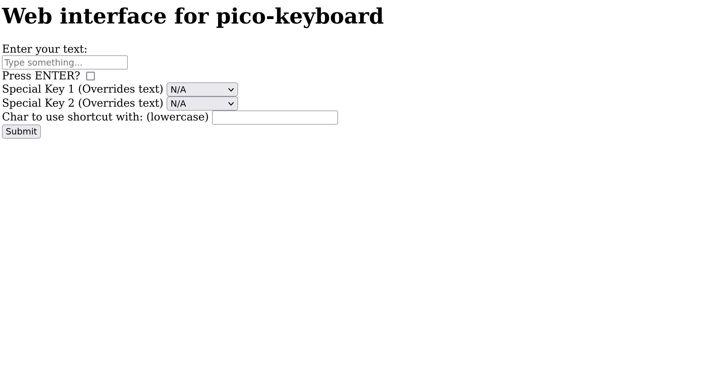

## picow-keyboard
Turn your Raspberry Pi Pico W in a portable keyboard! Simply plug it into any system, connect to the AP it starts, and use this HTML interface to type out to the system as if the pico was a keyboard:




This was designed to be quick and easy to use, though there is a teensy bit of a setup involved.

## Installation Process
1. Hold down BOOTSEL button on the Pico before plugging it in. Download [CircuitPython 10.x for the Pico W](https://circuitpython.org/board/raspberry_pi_pico_w/) (currently 10.2.1) and drop the `.uf2` file onto the Pico.
2. Copy the bundled `lib/usb_keyboard` folder into the Pico's `lib` folder (create `lib` if it does not exist). This replaces the old external `adafruit_hid` library and uses CircuitPython 10's built-in `usb_hid` module.
3. Download the [adafruit_httpserver library](https://github.com/adafruit/Adafruit_CircuitPython_HTTPServer/releases/latest) and copy `adafruit_httpserver` into the Pico's `lib` folder. Use either the **10.x** `.mpy` zip from a recent release (e.g. `adafruit-circuitpython-httpserver-10.x-mpy-4.8.2.zip` from [4.8.2](https://github.com/adafruit/Adafruit_CircuitPython_HTTPServer/releases/tag/4.8.2)), or the **9.x** `.mpy` zip from an older release (e.g. `adafruit-circuitpython-httpserver-9.x-mpy-4.5.8.zip` from [4.5.8](https://github.com/adafruit/Adafruit_CircuitPython_HTTPServer/releases/tag/4.5.8)) — 9.x libraries are compatible with CircuitPython 10.
4. Copy `boot.py` and `code.py` into the root of the Pico.


## Usage
Network SSID: `picow-keyboard`

Network Pass: `picow-keyboard`

Navigate to http://192.168.4.1/ (the AP IP configured in `code.py`)


## Useful Debugging Commands
If you want to look at the console output, run this command:

```
sudo minicom -D /dev/ttyACM0
```

It shows you the output of the script, as well as allow you to reload the script.
